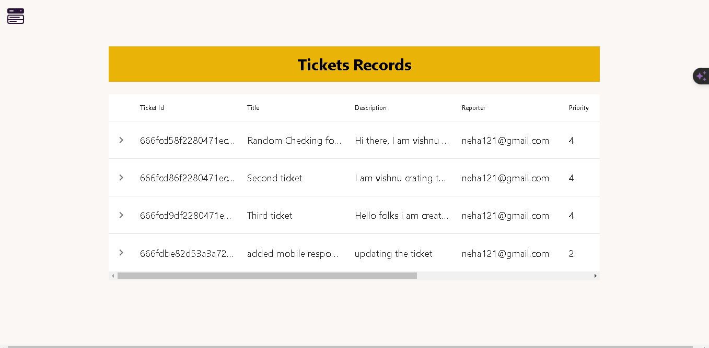
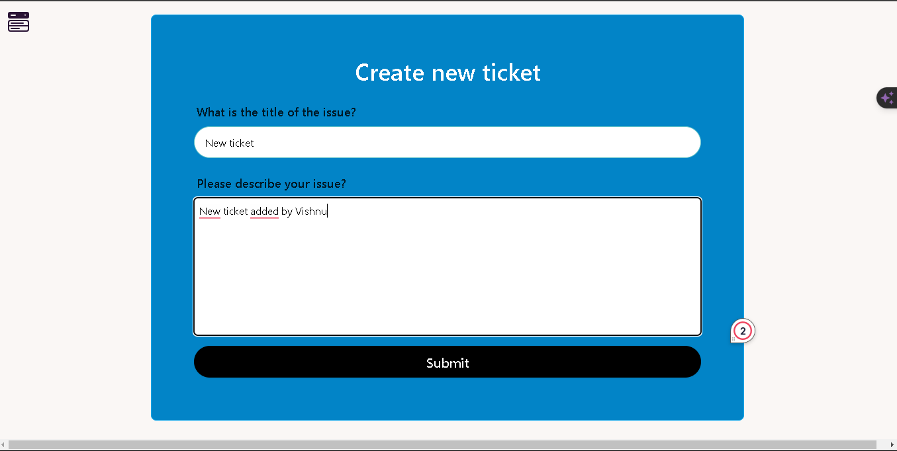

# CRM App

The CRM App is a customer relationship management application developed using React and Vite, with Redux for state management and Tailwind CSS for the user interface. This application allows users to log in, sign up, create, update, and manage tickets. It also features data visualization using a pie chart to display ticket distribution and a data table for detailed ticket information.

## Key Features

- User Authentication: Login and Signup functionality.

- Ticket Management: Create, update, and manage tickets.

- Data Visualization: View ticket distribution through a pie chart.

- Responsive Data Table: Display ticket details in a sortable and searchable table.

- Responsive Design: Mobile and desktop-friendly UI using Tailwind CSS.

## Technologies Used

- React: A JavaScript library for building user interfaces.

- Vite: A build tool that provides a faster and leaner development experience for modern web projects.

- Vite: A build tool that provides a faster and leaner development experience for modern web projects.

- Tailwind CSS: A utility-first CSS framework for rapid UI development. 

- React Chart: A library for creating charts in React applications.
 
- React Data Table: A library for displaying data in tables in React applications.

## Project Demo Link

If You face any problem to open the deploy whole project. You can refer this link. 

https://drive.google.com/drive/folders/1xnPIv_wRGvq6vPdChgnJqH1Nchci4kkB?usp=sharing
## Screenshots

